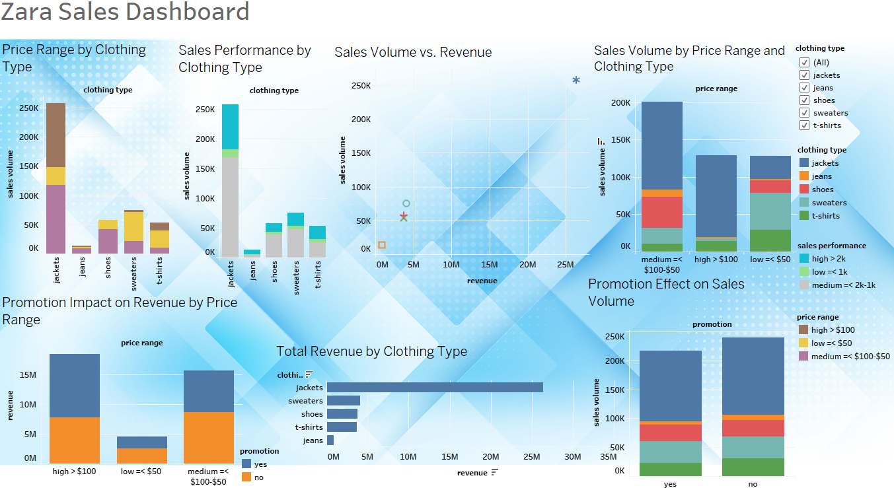

# Zara Sales

## Overview

This project analyzes Zara's sales performance based on clothing type, price range, and promotions. The goal is to explore how these factors influence sales volume and revenue, providing insights into which categories perform best and how promotional strategies can be optimized.

## Tools
* **Data transformation, cleaning, exploration & Analysis**: Google Sheets
* **Data Visualization**: Tableau
* **Project Management**: GitHub
## View
* [Main Project Documentation](Zara_Sales.md)
* [Cleaned Sheet And Pivot Table In Google Sheets](https://docs.google.com/spreadsheets/d/1qM-US_Z5_eA7O50pTH4mnvdmK9CdFFQiH45qe5BHRhE/edit?gid=1289955676#gid=1289955676)
* [Visualization In Tableau](https://public.tableau.com/app/profile/aurimas.naujalis/viz/Zarasales/Zarasales#1)

