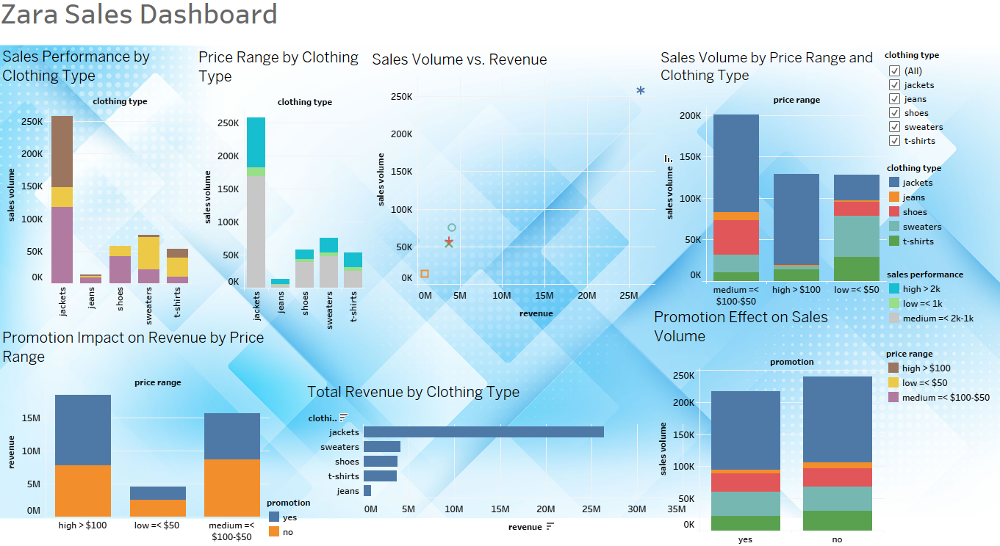

# Zara Sales By Product

## This project was completed for practise.

# Corporate Background:
Zara, founded in 1975 in Spain, is a leading fast fashion brand. Known for its quick response to trends, it offers affordable clothing, accessories, and footwear globally. With a vertically integrated supply chain, Zara efficiently designs, produces, and distributes new styles.
It operates in over 90 countries and emphasizes sustainability through eco-friendly initiatives.

# Tasks:
* How do clothing type, price range, and promotions influence sales performance, sales volume, and revenue?
* Analyze category-level performance by comparing sales volume and revenue between promoted and non-promoted products with a pivot table.
* Prepare data for further analysis.

# Data Description:
* Data is [public in Kaggle](https://www.kaggle.com/datasets/xontoloyo/data-penjualan-zara/data) and released under [MIT License](https://www.mit.edu/~amini/LICENSE.md).
* Data is in one `.csv` format file and contains (83.15 kB) of information.
* The dataset contains records of **`Product ID`,	`Product Position`,	`Promotion`,	`Product Category`,	`Seasonal`,	`Sales Volume`,	`brand	url`,	`sku`,	`name`,	`description`,	`price`,	`currency`,	`scraped_at`,	`terms	section`** coulmns and has 253 rows.
* Data is stored in Google Sheets.

# Data Processing And Cleaning:
* [View of data exploration, cleaning and manupilation process](path/to/Exploration, cleaning, transformation.MD). process done in Google Sheets.
* Vizualisation developed with Tableau.
* Adding 4 new columns - `price range`(where low indicates price lower then 50$ and equal, medium between 50$ and 100$(equal) and high over 100$), `sales performance` column ( low below 1000 and equal sales, ,medium between 1000 and 2000(equal), high over 2000), `promotion flag` column for promotion status (1 for promoted, 0 for not promoted) for easier filtering or comparing, `revenue`(sales x price).

# Analyze And Share:
[Cleaned sheet and pivot table](https://docs.google.com/spreadsheets/d/1qM-US_Z5_eA7O50pTH4mnvdmK9CdFFQiH45qe5BHRhE/edit?usp=sharing) in Google Sheets.

[Tableau dashboard](https://public.tableau.com/app/profile/aurimas.naujalis/viz/Zarasales/Zarasales?publish=yes) was created to answer question - Which clothing types generate the highest sales volume and revenue, and how does price impact their performance?

**Price Range by Clothing Type** - Helps understand how clothing types are distributed across different price ranges.
* Most sold in high price range is jackets and lowest jeans.
* Most sold in medium price range is also jackets and lowest jeans.
* Most sold in low price is sweaters and lowest in jeans.

**Sales Performance by Clothing Type** - Shows which clothing types have the highest and lowest sales performance.
* Most in high performance volume sold is and lowest is jeans.
* Most in medium performance volume sold is jackets and lowest is jeans.
* Most in low performance volume sold jackets and lowest is jeans.

**Sales Volume vs. Revenue** - Helps identify whether high-selling products also generate the most revenue.
* Jackets have both the highest sales volume and revenue, making them the top-performing category.
* Jeans have the lowest sales volume and revenue, indicating low demand.

**Sales Volume by Price Range and Clothing Type** - Helps determine whether lower or higher-priced items sell more across different clothing categories.
* Jackets sold most volume in medium price range and least volume on low price range.
* Jeans sold most volume in medium price range and least on high price range.
* Shoes sold most volume in medium price range and least on low price range.
* Sweaters sold most of volume in low price range and least on high price range.
* T-shirts sold most on low price range and least on high price range.

**Promotion Impact on Revenue by Price Range** - Examines whether promotions help increase revenue across different price ranges.
* High price range clothes with promotiom generated more revenue.
* Medium price range clothes with promotion generated less revenue.
* Low price range clothes with promotion generated less renevue.

**Total Revenue by Clothing Type** - helps to identify top-performing categories.
* Jackets generate most revenue $26 344 713.
* Sweats, shoes and t shirts generate very simmilar revenue between ~$3 700 000-$4 090 000.
* Jeans generate only $864 385.

**Promotion Effect on Sales Volume** - Reveals whether promotions significantly boost sales volume and which clothing types benefit most.
* Jackets sale volume are higher without promotion.
* Jeans sale volume are higher without promotion.
* Shoes sale volume are higher with promotion.
* Sweaters  sale volume are higher without promotion.
* T-shirts  sale volume are higher without promotion.

